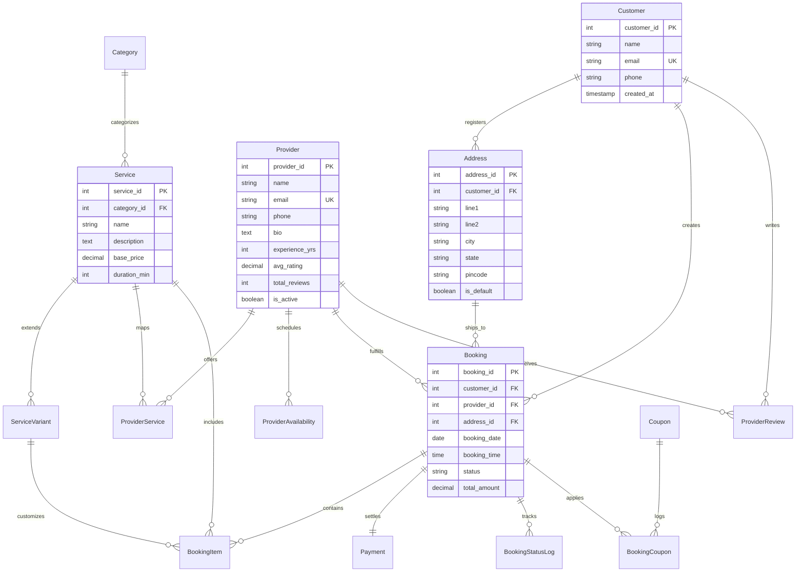

#  HomeServe — Home Service Booking Platform

A premium, production-ready full-stack **Home Service Booking Platform** built with a modern **Node.js/Express.js MVC** backend, **PostgreSQL** relational database, **EJS** Server-Side Rendering (SSR), and **Bootstrap 5**. Designed with a high-end abyssal dark theme, this project serves as a showcase of robust database architecture, MVC design pattern, and interactive user experiences.

---

##  Database Schema (ER Diagram)

This entity-relationship model showcases a highly optimized relational database structure:



---

##  Key DBMS Features

This platform emphasizes database-level performance, data integrity, and strict constraints:

### 1. High-Performance SQL Views
Instead of running heavy relational joins on the server, analytical queries are compiled directly on PostgreSQL views:
*   `vw_service_details`: Joins services, categories, and pricing variants.
*   `vw_booking_summary`: Merges booking statuses, customer profiles, address metadata, and payments.
*   `vw_provider_analytics`: Aggregates active jobs, historical ratings, and lifetime provider revenues.
*   `vw_revenue_by_month`: Pre-computes monthly platform transaction volumes.

### 2. Transactional Stored Procedures
- **`fn_create_booking`**: Integrates booking entries, item details, coupons, and payments inside a strict transactional boundary with a complete auto-rollback guarantee if any single insert fails.
- **`fn_calculate_booking_amount`**: Performs server-side calculations of service base prices, optional variant add-ons, and coupon discounts.

### 3. Automated PL/pgSQL Triggers
- **Prevent Double-Booking**: Rejects confirmed requests if the selected provider is already booked for that date/time slot.
- **Live Rating Recalculations**: Automatically updates `avg_rating` and `total_reviews` in the `Provider` table whenever a new review is inserted or modified.
- **Coupon Controls**: Increments coupon usage counters and checks limits dynamically on checkout.

---

##  Tech Stack & Token System

- **Backend:** Node.js, Express.js (MVC)
- **Database:** PostgreSQL (Client Pool, SSL enabled)
- **Template Engine:** EJS (Dynamic Server-Side Rendering)
- **Frontend Design:** Custom Abyssal CSS (Matter display types, 18-20px glass surfaces), GSAP (entrance & floating physics loops), Bootstrap 5.3, Chart.js 4
- **Security:** Helmet.js, parameterized queries (SQL injection prevention), Express Validator sanitization

---

##  Getting Started

### 1. Prerequisites
- **Node.js** (v18+)
- **PostgreSQL** (v14+)

### 2. Install Dependencies
```bash
npm install
```

### 3. Setup Configuration
Copy `.env.example` to `.env` and fill in your PostgreSQL credentials:
```bash
cp .env.example .env
```
Inside `.env`:
```env
DB_HOST=localhost
DB_PORT=5432
DB_NAME=home_services
DB_USER=postgres
DB_PASSWORD=your_actual_password_here
PORT=3000
NODE_ENV=development
```

### 4. Create Database & Run SQL Scripts
Create a local database named `home_services` and execute the schema files in the following order:
```bash
psql -U postgres -d home_services -f database/schema.sql
psql -U postgres -d home_services -f database/indexes.sql
psql -U postgres -d home_services -f database/views.sql
psql -U postgres -d home_services -f database/triggers.sql
psql -U postgres -d home_services -f database/procedures.sql
psql -U postgres -d home_services -f database/seed.sql
```

### 5. Launch the Platform
```bash
# Start server in development mode (with nodemon auto-restart)
npm run dev

# Start server in production mode
npm start
```
Open **http://localhost:3000** in your browser.

---

##  API Reference

| Endpoint | Method | Role |
|:---|:---|:---|
| `/` | `GET` | Home page with trust cards, category filters, and live search |
| `/services/:id` | `GET` | Service overview, pricing variants, and matching providers |
| `/book/:serviceId` | `GET` | Checkout page setup |
| `/book` | `POST` | Processes the booking transaction |
| `/bookings` | `GET` | Customer booking history (demo `customer_id=1`) |
| `/bookings/:id/review` | `POST` | Submits customer rating & review feedback |
| `/provider` | `GET` | Provider portal dashboard (demo `provider_id=1`) |
| `/provider/availability` | `POST` | Appends active availability slots |
| `/analytics` | `GET` | Analytics dashboard displaying KPI graphs and charts |

---

##  Security & Production Validation

- **Content Security Policy:** Configured via Helmet.js to secure scripts, styles, and fonts origins.
- **Atomic Isolation:** All multi-step bookings utilize database transactions ensuring data rollback on network failure.
- **Production SSL Support:** Configured automatically inside `config/db.js` for seamless cloud hosting (Render, Railway, Neon).
- **Parameterized Protection:** All SQL commands run through pg-pool positional arguments preventing SQL injection vectors.
