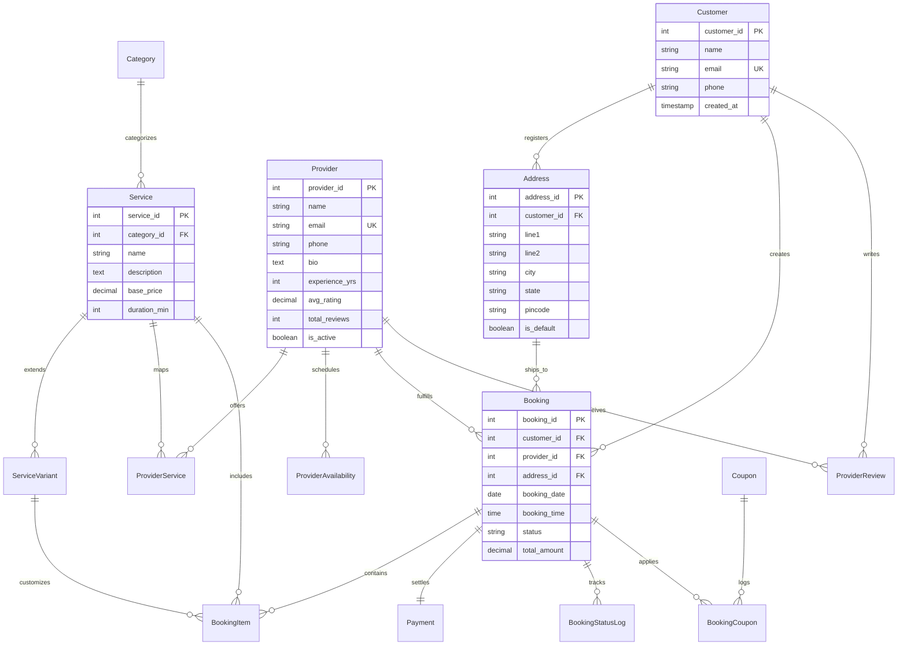

# HomeServe — Home Service Booking Platform

**Live Demo:** [homeserve-e1pi.onrender.com](https://homeserve-e1pi.onrender.com/)
> Note: hosted on Render's free tier — the app may take a few seconds to spin up on first load.

A full-stack **home service booking platform** built with a **Node.js/Express.js MVC** backend, **PostgreSQL** relational database, **EJS** server-side rendering, and **Bootstrap 5**. The project doubles as a showcase of solid relational database design (views, triggers, stored procedures) alongside a clean MVC application structure.

---

## About

HomeServe connects customers looking for home services — like cleaning, repairs, or maintenance — with local providers. Customers can browse services, check pricing and availability, and book a provider in a few clicks, while providers manage their schedules and track jobs through a dedicated dashboard. Beyond the customer-facing flow, the project was built as a deep dive into relational database design: enforcing business rules (like preventing double-bookings) directly at the database level with triggers, stored procedures, and views, rather than relying solely on application code.

---

## Features

- Browse service categories, view pricing variants, and find matching providers
- End-to-end booking flow with transactional checkout (items, coupons, payment)
- Customer booking history with ratings/review submission
- Provider dashboard for managing availability
- Analytics dashboard with KPI charts (revenue, bookings, ratings)
- Double-booking prevention and live rating recalculation via database triggers

---

## Tech Stack

| Layer | Technology |
|---|---|
| Backend | Node.js, Express.js (MVC) |
| Database | PostgreSQL (connection pool, SSL-ready) |
| Templating | EJS (server-side rendering) |
| Frontend | Bootstrap 5.3, custom CSS, GSAP, Chart.js 4 |
| Security | Helmet.js (CSP), express-validator, parameterized queries |

---

## Project Structure

```
HomeServe/
├── app.js                  # Express app entry point
├── config/
│   └── db.js                # PostgreSQL pool configuration
├── controllers/             # Route handlers (MVC controllers)
├── models/                  # Data access layer
├── routes/                  # Express route definitions
├── middleware/
│   └── errorHandler.js
├── views/                   # EJS templates
│   └── partials/
├── public/                  # Static assets (css, js, images)
├── database/
│   ├── schema.sql            # Table definitions
│   ├── indexes.sql           # Performance indexes
│   ├── views.sql              # Analytical SQL views
│   ├── triggers.sql           # PL/pgSQL triggers
│   ├── procedures.sql         # Stored procedures/functions
│   └── seed.sql                # Sample data
└── package.json
```

---

## Database Schema (ER Diagram)



---

## Key Database Features

**SQL Views** — pre-joined data for common queries:
- `vw_service_details` — services, categories, pricing variants
- `vw_booking_summary` — booking status, customer, address, payment
- `vw_provider_analytics` — provider jobs, ratings, revenue
- `vw_revenue_by_month` — monthly transaction volume

**Stored Procedures** — transactional integrity:
- `fn_create_booking` — inserts booking, items, coupons, and payment in a single transaction with rollback on failure
- `fn_calculate_booking_amount` — computes totals from base price, variants, and coupon discounts

**Triggers** — automated data consistency:
- Prevents double-booking a provider for the same date/time slot
- Recalculates provider `avg_rating` / `total_reviews` on review insert/update
- Enforces coupon usage limits at checkout

---

## Getting Started

### Prerequisites
- Node.js v18+
- PostgreSQL v14+

### 1. Install dependencies
```bash
npm install
```

### 2. Configure environment
Create a `.env` file in the project root:
```env
DB_HOST=localhost
DB_PORT=5432
DB_NAME=home_services
DB_USER=postgres
DB_PASSWORD=your_actual_password_here
PORT=3000
NODE_ENV=development
```

### 3. Set up the database
Create a database named `home_services`, then run the SQL scripts in order:
```bash
npm run db:schema
npm run db:indexes
npm run db:views
npm run db:triggers
npm run db:procedures
npm run db:seed
```

### 4. Run the app
```bash
npm run dev     # development, with nodemon
npm start       # production
```

Visit **http://localhost:3000**.

---

## API Reference

| Endpoint | Method | Description |
|---|---|---|
| `/` | GET | Home page with category filters and search |
| `/services/:id` | GET | Service details, pricing variants, matching providers |
| `/book/:serviceId` | GET | Checkout page |
| `/book` | POST | Processes a booking transaction |
| `/bookings` | GET | Customer booking history |
| `/bookings/:id/review` | POST | Submit a rating/review |
| `/provider` | GET | Provider dashboard |
| `/provider/availability` | POST | Add availability slots |
| `/analytics` | GET | Analytics dashboard (KPIs, charts) |

---

## Security

- **Helmet.js** Content Security Policy restricting script/style/font origins
- **Parameterized queries** throughout (via `pg`) to prevent SQL injection
- **express-validator** for input sanitization
- **Database transactions** for atomic, multi-step booking writes
- **SSL-ready** PostgreSQL config for cloud hosting (Render, Railway, Neon)

---

## License

ISC