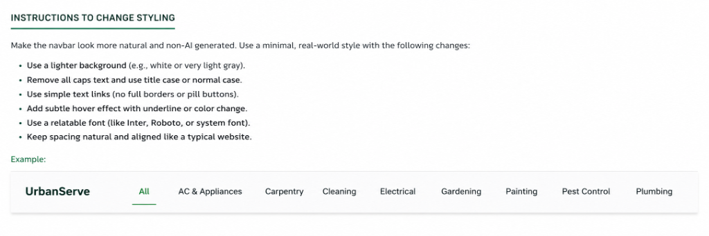

# 🏠 HomeServe — Home Service Booking Platform

[](https://nodejs.org/)
[](https://www.postgresql.org/)
[](https://opensource.org/licenses/ISC)
[](https://expressjs.com/)

A premium, production-ready full-stack **Home Service Booking Platform** built using **Node.js**, **Express.js**, **PostgreSQL**, **EJS**, and **Bootstrap 5**. Designed with a modern abyssal dark theme, this project serves as a showcase of robust database architecture, MVC design pattern, and interactive user experiences.

---

## 🌟 Visual Showcase

### Elegant Hero & Trust Showcase


### Dynamic Booking & Provider Management


### Platform Analytics Dashboard


---

## 📋 Features

| Feature | Description |
|:---|:---|
| 🏠 **Home Page** | Premium SaaS hero landing page featuring floating trust metrics and interactive professional reviews. Browse services via categories with client-side searching. |
| 📄 **Service Detail** | Detailed service descriptions, dynamic pricing variants, and instant provider match lists. |
| 📅 **Book Service** | Direct booking interface with concurrent double-booking prevention, automatic backend amount calculations, and coupon application. |
| 📋 **Booking History** | Tracks active, confirmed, completed, or cancelled bookings with customer feedback and review submittals. |
| 🔧 **Provider Dashboard** | Dedicated console for providers to toggle daily availability slots, view client reviews, and track completed jobs. |
| 📊 **Analytics Dashboard** | Full platform KPIs displaying revenue charts, category performance, top service products, and highest-rated professionals. |

---

## 🗄️ Database Architecture & DBMS Concepts

The platform is designed with a highly optimized relational database structure in PostgreSQL, highlighting core DBMS principles:

*   **Views:** Complex read joins consolidated into high-performance views like `vw_service_details`, `vw_booking_summary`, `vw_provider_analytics`, and `vw_revenue_by_month`.
*   **Triggers:** Custom trigger functions handling auto status logging, dynamic provider rating recalculations, coupon usage increment limits, and concurrent double-booking validations.
*   **Stored Procedures:** Programmatic routines (`fn_create_booking`, `fn_calculate_booking_amount`, `fn_update_booking_status`) packing core business logic directly on the SQL compiler engine.
*   **Performance Indexes:** 17 strategically placed B-Tree indexes targeting foreign key constraints, status flags, and search keywords for sub-millisecond query performance.
*   **Transactions:** Complete ACID transactions wrapping all multi-table booking operations with atomic ROLLBACK safeguards on failure.

---

## 🛠️ Tech Stack

- **Backend:** Node.js, Express.js (MVC)
- **Database:** PostgreSQL (Client Pool)
- **Template Engine:** EJS (Dynamic SSR)
- **Frontend Styling:** Custom Abyssal CSS (matter tokens, light glass backdrops), GSAP (entrance & float loops), Bootstrap 5.3, Chart.js 4
- **Security:** Helmet.js, parameterized queries (SQL Injection prevention), Express Validator sanitization

---

## 🚀 Installation & Running Locally

### Prerequisites
- Node.js v18+
- PostgreSQL v14+
- Terminal (PowerShell, CMD, or Bash)

### 1. Clone & Install Dependencies
```bash
git clone <your-repository-url>
cd DBMS
npm install
```

### 2. Configure Environment Variables
Copy `.env.example` to `.env` and fill in your PostgreSQL credentials:
```bash
cp .env.example .env
```
Inside `.env`:
```env
DB_HOST=localhost
DB_PORT=5432
DB_NAME=home_services
DB_USER=postgres
DB_PASSWORD=your_actual_password_here
PORT=3000
NODE_ENV=development
```

### 3. Create the Database
```sql
CREATE DATABASE home_services;
```

### 4. Run Schema & Setup Scripts (in order)
Run these commands in your shell to bootstrap the schema, constraints, procedures, and demo seed data:
```bash
psql -U postgres -d home_services -f database/schema.sql
psql -U postgres -d home_services -f database/indexes.sql
psql -U postgres -d home_services -f database/views.sql
psql -U postgres -d home_services -f database/triggers.sql
psql -U postgres -d home_services -f database/procedures.sql
psql -U postgres -d home_services -f database/seed.sql
```

### 5. Launch the Platform
```bash
# Run in development mode with nodemon auto-restart
npm run dev

# Or run in production mode
npm start
```
Open **http://localhost:3000** in your browser.

---

## 📂 Project Structure

```
DBMS/
├── app.js                    # Express Application Entry
├── .env.example              # Environment Configuration Template
├── README.md                 # Project Documentation
├── package.json              # Dependencies & Scripts Configuration
│
├── config/
│   └── db.js                 # PostgreSQL Pool Setup & SSL configuration
│
├── database/                 # Structured SQL Database Scripts
│   ├── schema.sql            # Table structures, relations & constraints
│   ├── indexes.sql           # Query optimization indexes
│   ├── views.sql             # SQL Views for aggregations
│   ├── triggers.sql          # Pl/pgSQL triggers
│   ├── procedures.sql        # Database functions & transactions
│   └── seed.sql              # Rich demo datasets
│
├── controllers/              # MVC Controller Logic
│   ├── homeController.js
│   ├── serviceController.js
│   ├── bookingController.js
│   ├── providerController.js
│   └── analyticsController.js
│
├── models/                   # Modular SQL Query Models
│   ├── serviceModel.js
│   ├── bookingModel.js
│   ├── providerModel.js
│   └── analyticsModel.js
│
├── routes/                   # Routing Middleware Mapping
│   ├── index.js
│   ├── serviceRoutes.js
│   ├── bookingRoutes.js
│   ├── providerRoutes.js
│   └── analyticsRoutes.js
│
├── views/                    # EJS Pages and Layout Partials
│   ├── partials/             # Header, Footer, and Navbar blocks
│   ├── index.ejs             # Landing page with trust cards
│   ├── service-detail.ejs    # Service profiles
│   ├── booking-form.ejs      # Checkout form
│   ├── booking-history.ejs   # Client booking overview
│   ├── provider-dashboard.ejs# Provider portal
│   ├── analytics.ejs         # Admin KPI boards
│   ├── 404.ejs               # Clean 404 handler page
│   └── 500.ejs               # Custom 500 error display
│
├── public/                   # Public static files
│   ├── css/style.css         # Dark theme style system
│   ├── js/main.js            # Particle canvas configurations
│   └── README-assets/        # Showcase screenshots
│
└── middleware/
    └── errorHandler.js       # Express Global Error handling
```

---

## 🌐 API & Route Documentation

| Route | Method | Description |
|:---|:---|:---|
| `/` | `GET` | Home page displaying services list, filters, and trust showcases |
| `/services/:id` | `GET` | Service details, prices, and matching providers |
| `/book/:serviceId` | `GET` | Initiates the secure booking process |
| `/book` | `POST` | Processes the ACID booking transaction |
| `/bookings` | `GET` | Customer booking history (uses demo `customer_id=1` for showcase) |
| `/bookings/:id/review` | `POST` | Submits a customer review |
| `/provider` | `GET` | Portal dashboard for providers (uses demo `provider_id=1` for showcase) |
| `/provider/availability` | `POST` | Appends active service timeslot slots |
| `/analytics` | `GET` | Displays dashboard charts, graphs, and metric lists |
| `/api/calculate-amount` | `GET` | Dynamic pricing API endpoint |

---

## 🔐 Security & Production Verification

- **Helmet CSP Configuration:** Restricts resources to self-origin, google fonts, and trusted CDNs (GSAP, Chart.js).
- **Injection Safety:** All SQL queries are parameterised using PostgreSQL positional arguments (`$1`, `$2`).
- **Input Sanitization:** Server-side validating handles input lengths, email validation, and past date bounds.
- **Production SSL Support:** Configured automatically inside `config/db.js` if deploying on cloud platforms like **Render**, **Railway**, or **Neon** that require secure database channels.

---

## 📄 License

This project is licensed under the [ISC License](LICENSE). Feel free to modify and adapt it for showcasing database concepts.
