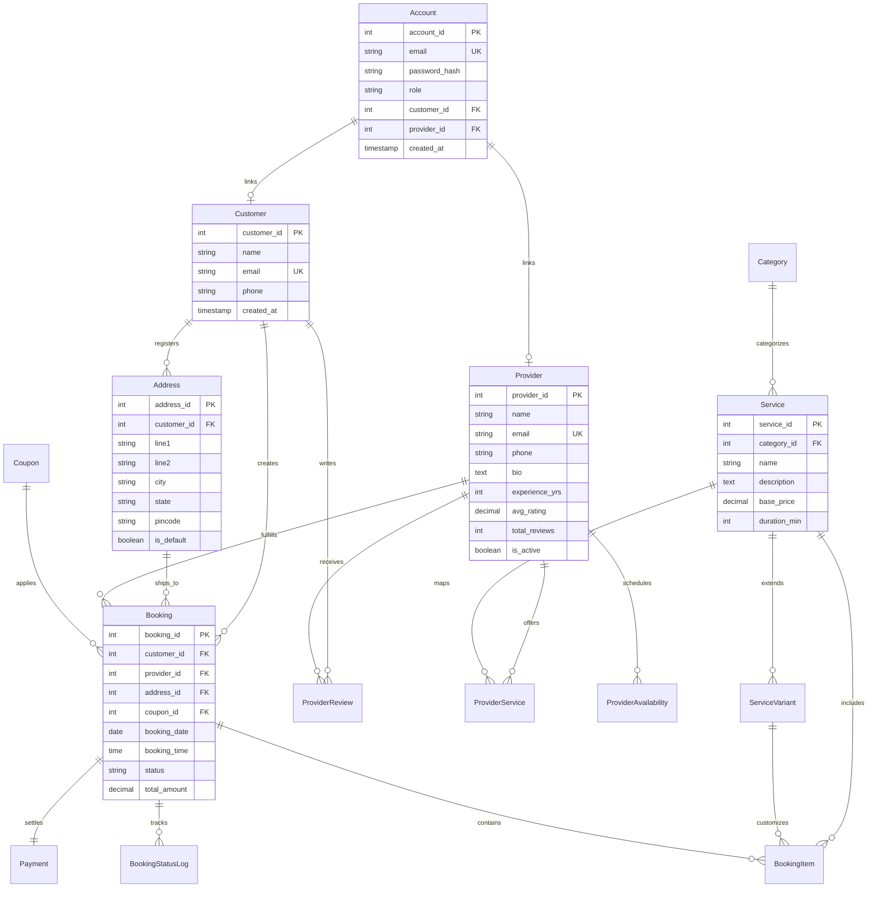

# HomeServe — Home Service Booking Platform

**Live Demo:** [homeserve-e1pi.onrender.com](https://homeserve-e1pi.onrender.com/)
> Note: hosted on Render's free tier — the app may take a few seconds to spin up on first load.

A full-stack **home service booking platform** built with a **Node.js/Express.js MVC** backend, **PostgreSQL** relational database, **EJS** server-side rendering, and **Bootstrap 5**. The project doubles as a showcase of solid relational database design (views, triggers, stored procedures) alongside a clean MVC application structure.

---

## About

HomeServe connects customers looking for home services — like cleaning, repairs, or maintenance — with local providers. Customers can browse services, check pricing and availability, and book a provider in a few clicks, while providers manage their schedules and track jobs through a dedicated dashboard. Beyond the customer-facing flow, the project was built as a deep dive into relational database design: enforcing business rules (like preventing double-bookings) directly at the database level with triggers, stored procedures, and views, rather than relying solely on application code.

---

## Features

- **User Authentication** — register & login with email/password (Passport.js + bcrypt), persistent server-side sessions stored in PostgreSQL
- **Role-Based Access Control** — three roles (**Customer**, **Provider**, **Admin**) with middleware guards on every route
- **User Profile & Address Management** — update profile details, add/remove addresses, set a default address
- Browse service categories, view pricing variants, and find matching providers
- End-to-end booking flow with transactional checkout (items, coupons, payment)
- Customer booking history with ratings/review submission
- Provider dashboard for managing availability and tracking bookings
- Analytics dashboard with KPI charts (revenue, bookings, ratings) — admin-only
- Double-booking prevention and live rating recalculation via database triggers
- **Premium UI** — Attio-inspired light monochrome editorial design, GSAP-animated floating capsule navbar, skewX hover sweep buttons, and floating-label search inputs
- **Test Suite** — integration tests for authentication, bookings, services, and home page using Jest + Supertest

---

## Tech Stack

| Layer | Technology |
|---|---|
| Backend | Node.js, Express.js (MVC) |
| Database | PostgreSQL (connection pool, SSL-ready) |
| Authentication | Passport.js (Local Strategy), bcrypt, express-session |
| Session Store | PostgreSQL (`connect-pg-simple`) |
| Templating | EJS (server-side rendering) |
| Frontend | Bootstrap 5.3, custom CSS, GSAP, Chart.js 4 |
| Testing | Jest, Supertest |
| Security | Helmet.js (CSP), express-validator, parameterized queries |

---

## Project Structure

```
HomeServe/
├── app.js                    # Express app entry point
├── config/
│   ├── db.js                  # PostgreSQL pool configuration
│   └── passport.js            # Passport Local Strategy + serialize/deserialize
├── controllers/               # Route handlers (MVC controllers)
│   ├── homeController.js
│   ├── serviceController.js
│   ├── bookingController.js
│   ├── providerController.js
│   ├── analyticsController.js
│   └── user.js                # Auth (register, login, logout, profile)
├── models/                    # Data access layer
│   ├── serviceModel.js
│   ├── bookingModel.js
│   ├── providerModel.js
│   └── analyticsModel.js
├── routes/                    # Express route definitions
│   ├── index.js
│   ├── serviceRoutes.js
│   ├── bookingRoutes.js
│   ├── providerRoutes.js
│   ├── analyticsRoutes.js
│   └── user.js                # Auth & profile routes
├── middleware/
│   ├── auth.js                # ensureAuthenticated, ensureRole, forwardAuthenticated
│   └── errorHandler.js
├── views/                     # EJS templates
│   ├── partials/
│   ├── login.ejs
│   ├── register.ejs
│   ├── profile.ejs
│   ├── 403.ejs
│   └── ...
├── public/                    # Static assets (css, js, images)
├── database/
│   ├── schema.sql              # Table definitions (incl. Account & session)
│   ├── indexes.sql             # Performance indexes
│   ├── views.sql               # Analytical SQL views (6 views)
│   ├── triggers.sql            # PL/pgSQL triggers (5 triggers)
│   ├── procedures.sql          # Stored procedures/functions (5 functions)
│   └── seed.sql                # Sample data
├── tests/                     # Jest + Supertest integration tests
│   ├── auth.test.js
│   ├── bookings.test.js
│   ├── home.test.js
│   └── services.test.js
├── jest.config.js
└── package.json
```

---

## Database Schema (ER Diagram)



---

## Key Database Features

**SQL Views** — pre-joined data for common queries:
- `vw_service_details` — services, categories, pricing variants
- `vw_booking_summary` — booking status, customer, address, payment
- `vw_provider_analytics` — provider jobs, ratings, revenue
- `vw_top_services` — most booked services with booking count and revenue
- `vw_revenue_by_month` — monthly transaction volume
- `vw_provider_schedule` — provider bookings with full details for the dashboard

**Stored Procedures & Functions** — transactional integrity:
- `fn_create_booking` — inserts booking, items, coupons, and payment in a single transaction with rollback on failure
- `fn_calculate_booking_amount` — computes totals from base price, variants, and coupon discounts
- `fn_update_booking_status` — updates booking status, logs the change, and auto-marks payment as paid on completion
- `fn_get_analytics` — returns platform-wide KPIs (customers, providers, bookings, revenue, ratings) as a table
- `proc_add_provider_availability` — adds availability with time-range overlap validation

**Triggers** — automated data consistency:
- Auto-inserts initial `Pending` status log when a booking is created
- Recalculates provider `avg_rating` / `total_reviews` on review insert/update
- Prevents double-booking a provider for the same date/time slot
- Increments coupon `times_used` counter on booking creation
- Auto-sets `paid_at` timestamp when payment status transitions to `Paid`

---

## Authentication & Authorization

HomeServe uses **Passport.js** with a **Local Strategy** for email/password authentication and **bcrypt** for password hashing.

| Concept | Implementation |
|---|---|
| Strategy | `passport-local` — authenticates against the `Account` table |
| Password Hashing | `bcrypt` with salt rounds |
| Session Storage | PostgreSQL via `connect-pg-simple` (server-side, `session` table) |
| Session Cookie | `httpOnly`, `secure` in production, `sameSite: lax`, 24-hour TTL |
| Roles | `customer`, `provider`, `admin` — enforced by `ensureRole()` middleware |
| Route Guards | `ensureAuthenticated`, `ensureRole(...roles)`, `forwardAuthenticated` |

The `Account` table uses a CHECK constraint to enforce profile linkage:
- **Customers** must have a `customer_id` (no `provider_id`)
- **Providers** must have a `provider_id` (no `customer_id`)
- **Admins** have neither

---

## Getting Started

### Prerequisites
- Node.js v18+
- PostgreSQL v14+

### 1. Install dependencies
```bash
npm install
```

### 2. Configure environment
Create a `.env` file in the project root (see `.env.example`):
```env
DB_HOST=localhost
DB_PORT=5432
DB_NAME=home_services
DB_USER=postgres
DB_PASSWORD=your_actual_password_here
DB_SSL=false

# Or use a connection string for cloud PostgreSQL (Render / Railway / Neon)
DATABASE_URL=

PORT=3000
NODE_ENV=development
SESSION_SECRET=your_session_secret_here
```

### 3. Set up the database
Create a database named `home_services`, then run the SQL scripts in order:
```bash
npm run db:schema
npm run db:indexes
npm run db:views
npm run db:triggers
npm run db:procedures
npm run db:seed
```

### 4. Run the app
```bash
npm run dev     # development, with nodemon
npm start       # production
```

Visit **http://localhost:3000**.

### 5. Run tests
```bash
npm test
```

---

## API Reference

### Public Routes

| Endpoint | Method | Description |
|---|---|---|
| `/` | GET | Home page with category filters and search |
| `/services/:id` | GET | Service details, pricing variants, matching providers |
| `/login` | GET | Login page |
| `/login` | POST | Authenticate user |
| `/register` | GET | Registration page |
| `/register` | POST | Create new account |
| `/logout` | GET | End session |

### Customer Routes (role: `customer`)

| Endpoint | Method | Description |
|---|---|---|
| `/book/:serviceId` | GET | Checkout page |
| `/book` | POST | Process a booking transaction |
| `/bookings` | GET | Booking history |
| `/bookings/:id/review` | POST | Submit a rating/review |
| `/profile` | GET | Profile & address management |
| `/profile/update` | POST | Update profile details |
| `/profile/address` | POST | Add a new address |
| `/profile/address/:id/default` | POST | Set default address |
| `/profile/address/:id/delete` | POST | Remove an address |

### Provider Routes (role: `provider`)

| Endpoint | Method | Description |
|---|---|---|
| `/provider` | GET | Provider dashboard |
| `/provider/availability` | POST | Add availability slots |
| `/provider/availability/:id/delete` | POST | Remove an availability slot |

### Admin Routes (role: `admin`)

| Endpoint | Method | Description |
|---|---|---|
| `/analytics` | GET | Analytics dashboard (KPIs, charts) |
| `/bookings` | GET | All bookings (admin view) |
| `/bookings/:id/status` | POST | Update booking status |

### API Endpoints

| Endpoint | Method | Description |
|---|---|---|
| `/api/calculate-amount` | GET | AJAX price calculation (authenticated) |

---

## Security

- **Passport.js** session-based authentication with bcrypt password hashing
- **Role-based middleware** (`ensureRole`) protecting every sensitive route
- **Helmet.js** Content Security Policy restricting script/style/font origins
- **Server-side sessions** stored in PostgreSQL (no client-side JWTs)
- **Parameterized queries** throughout (via `pg`) to prevent SQL injection
- **express-validator** for input sanitization
- **Database transactions** for atomic, multi-step booking writes
- **SSL-ready** PostgreSQL config for cloud hosting (Render, Railway, Neon)
- **Secure cookies** — `httpOnly`, `secure` in production, `sameSite: lax`

---

## License

ISC